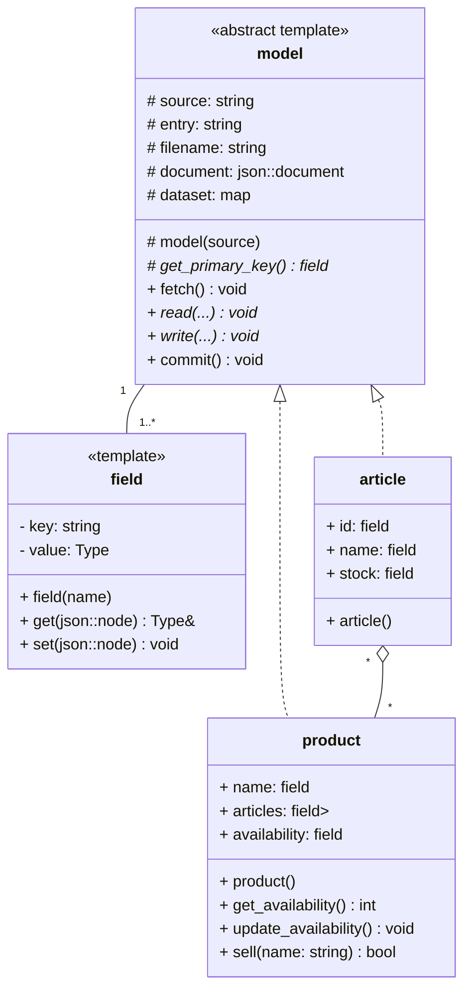

```mermaid
classDiagram
    model "1" -- "1..*" field
    model <|.. product
    model <|.. article
    article "*" o-- "*" product

    class field {
        <<template<Type>>>
        - key: string
        - value: Type
        + field(name)
        + get(json::node) Type&
        + set(json::node) void
    }

    class model {
        <<abstract template<PrimaryKey>>>
        # source: string
        # entry: string
        # filename: string
        # document: json::document
        # dataset: map<PrimaryKey, json::node>
        # model(source)
        # get_primary_key()* field<PrimeryKey>
        + fetch() void
        + read(...)* void
        + write(...)* void
        + commit() void
    }

    class article {
        + id: field<int>
        + name: field<string>
        + stock: field<int>
        + article()
    }

    class product {
        + name: field<string>
        + articles: field<map<int, int>>
        + availability: field<int>
        + product()
        + get_availability() int
        + update_availability() void
        + sell(name: string) bool
    }
```