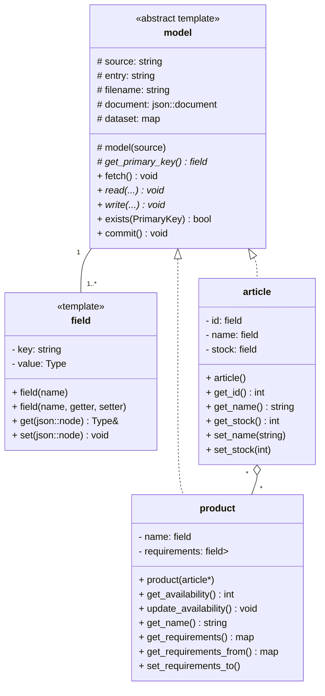

```mermaid
classDiagram
    model "1" -- "1..*" field
    model <|.. product
    model <|.. article
    article "*" o-- "*" product

    class field {
        <<template<Type>>>
        - key: string
        - value: Type
        + field(name)
        + field(name, getter, setter)
        + get(json::node) Type&
        + set(json::node) void
    }

    class model {
        <<abstract template<PrimaryKey>>>
        # source: string
        # entry: string
        # filename: string
        # document: json::document
        # dataset: map<PrimaryKey, json::node>
        # model(source)
        # get_primary_key()* field<PrimeryKey>
        + fetch() void
        + read(...)* void
        + write(...)* void
        + exists(PrimaryKey) bool
        + commit() void
    }

    class article {
        - id: field<int>
        - name: field<string>
        - stock: field<int>
        + article()
        + get_id() int
        + get_name() string
        + get_stock() int
        + set_name(string)
        + set_stock(int)
    }

    class product {
        - name: field<string>
        - requirements: field<map<int, int>>
        + product(article*)
        + get_availability() int
        + update_availability() void
        + get_name() string
        + get_requirements() map<int,int>
        + get_requirements_from() map<int,int>
        + set_requirements_to()
    }
```